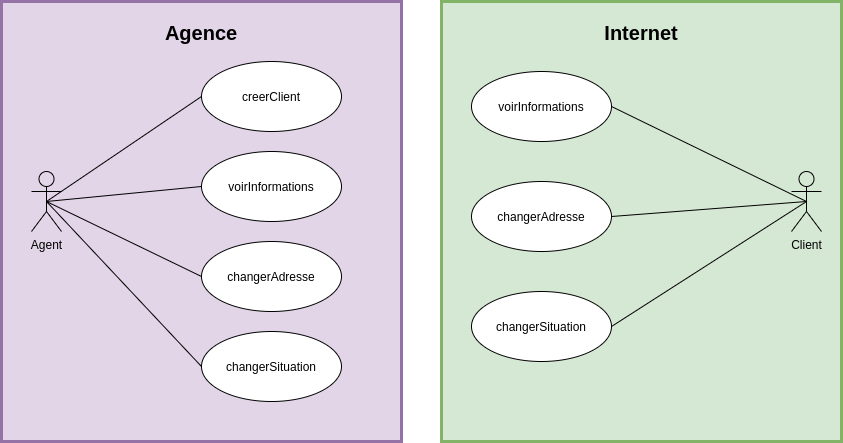
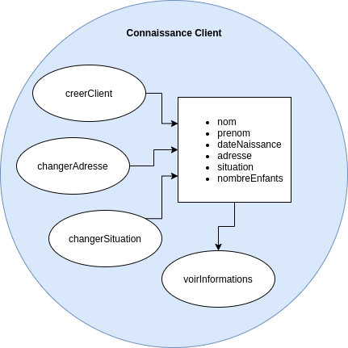
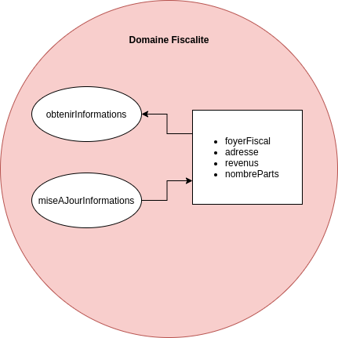
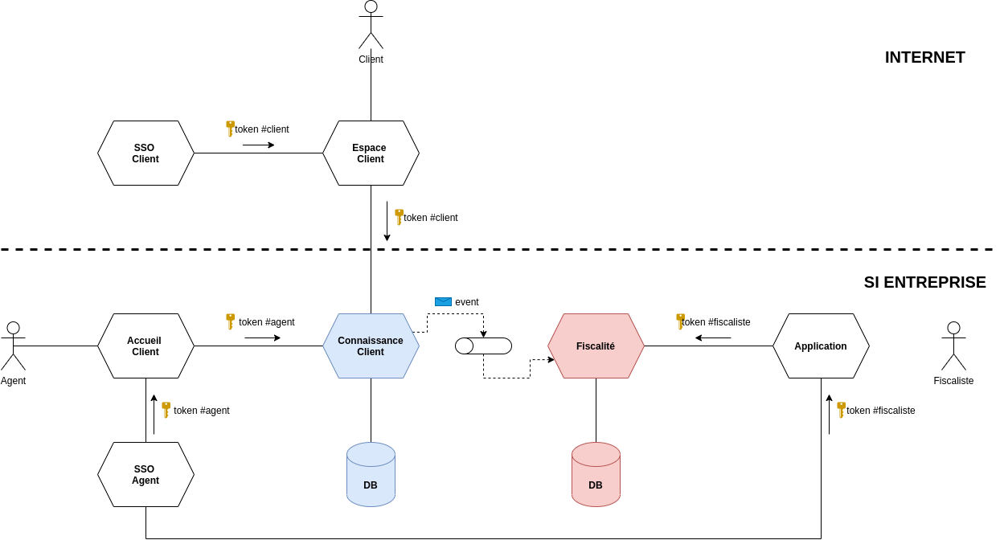
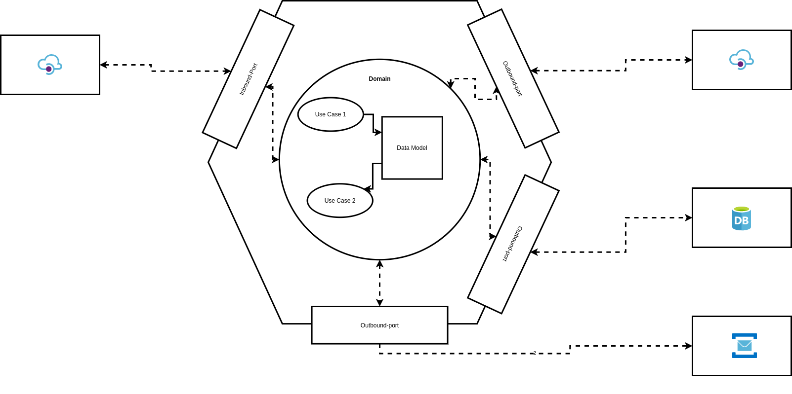
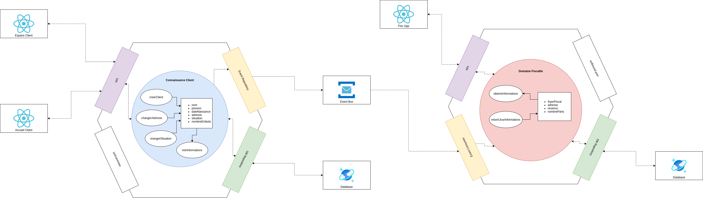
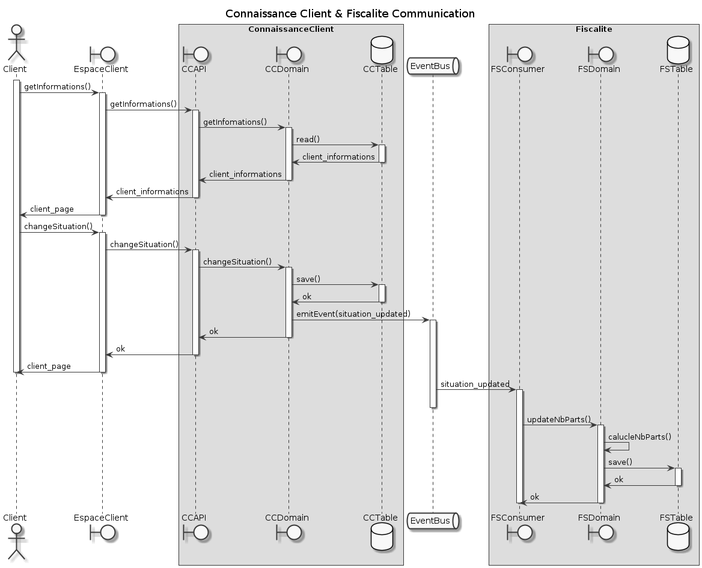
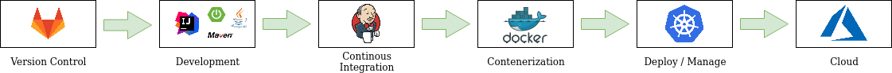
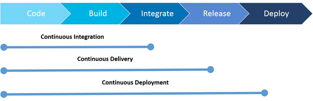
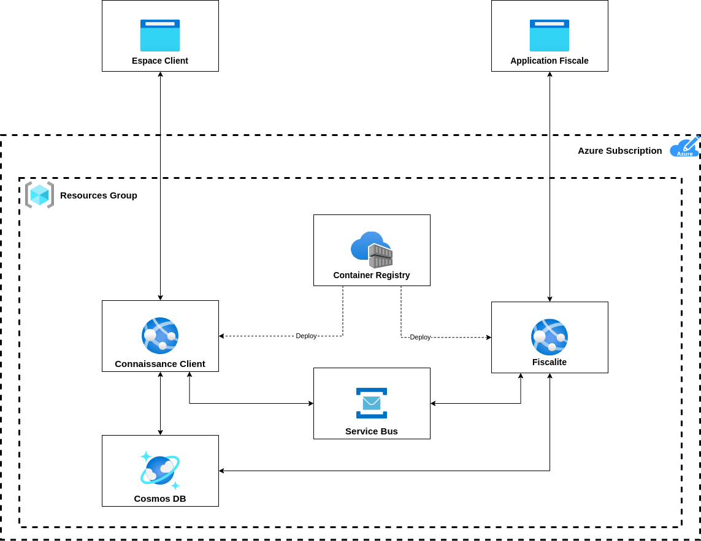

= Dossier d'Architecture Technique - Hello World
:doctype: book
:revnumber: 1.0
:classification: C1 - Internal
:sectnumlevels: 4
:toclevels: 4
:sectnums: 4
:toc: left
:icons: font
:toc-title: Sommaire

Dernière modification : {docdate} 

Etat du document : *DRAFT*

== Historique des révisions

.Versions du document
[cols="1,2,3,5,2,3"]
|===
| #   | Date       | Auteur            | Description | Validation | Approbateur 
| 0.1 | 17/10/2022 | Philippe Bousquet | Création    |            |
|===

== Documentation de Référence

.Références documentaires
[cols="1,1,4,4"]
|===
| N° | Version | Titre/URL du document | Détail
|
|===

== Glossaire

.Glossaire
[cols="2,6"]
|===
| Abréviation | Définition
|
|===

== Présentation Générale

=== Contexte Projet

Le client ONÉLÉBEST nous demande de réaliser un portail avec comme première fonctionnalité de saluer le visiteur.

Nous avons donc deux situations, où nous pouvons manipuler les données client :
    
* Par l'Agent (ou conseiller) dans son agence
* Par le Client, au travers de son espace client sur internet

==== Approche Domain Driven Design 

L’approche DDD vise, dans un premier temps, à isoler un domaine métier. Un domaine métier riche comporte les caractéristiques suivantes:

* Il approfondit les règles métier spécifiques et il est en accord avec le modèle d’entreprise, avec la stratégie et les processus métier.
* Il doit être isolé des autres domaines métier et des autres couches de l’architecture de l’application.
* Le modèle doit être construit avec un couplage faible avec les autres couches de l’application.
* Il doit être une couche abstraite et assez séparée pour être facilement maintenue, testée et versionnée.
* Le modèle doit être conçu avec le moins de dépendances possibles avec une technologie ou un framework. 
* Le domaine métier ne doit pas comporter de détails d’implémentation de la persistance.

==== Le Domaine Connaissance Client

*Ici nous définissons :*

* Un modèle : c'est quoi un client ?
* Les uses cases métiers : quelles sont les opérations permises ?

*On ne se soucis pas du tout de l'aspect technique :*

* Comment je peux accéder à ces opérations dans le SI ?
* Où et comment sont stockées mes données ?

==== Le Domaine Fiscalité

Définissons un nouveau domaine *Fiscalité*

Certaines données du domaine sont déduites des données du domaine *Connaissance Client*, comme par exemple le nombre de parts du foyer fiscal (dépendant du fait d'être marié ou non et du nombre d'enfants à charge)

=== Architecture Générale

Nous allons passer par de la communication par message (indépendance entre modules) :

* Lors d'une mise à jour, le dommaine *Connaissance Client* émet un évènement vers une queue (Event Hub, Kafka, RabbitMQ, ...)
* Le domaine *Fiscalité* écoute cette queue et, à réception d'un message va mettre à jour son modèle de données

== Architecture Applicative

=== Architecture Hexagonale

L'architecture hexagonale repose sur trois principes et techniques:

* Séparer explicitement la logique métier de la partie exposition (client-side) et persistence (server-side).
* Les dépendances partent des couches techniques (client-side / server-side) vers la couche logique métier
* Il faut isoler les couches en utilisant des ports et des adaptateurs

=== Architecture applicative détaillée

Tout en respectant les principes de l'architecture hexagonale, nous ajoutons un canal de communication entre les applications *Connaissance Client* et *Fiscalité*

==== Découpage modulaire

image:imgs/hexagonalArchitecture.png[width=512]

* Le _Binding_ *API* expose les APIs au front :
** Il y a une dépendence API -> Domaine (l'API voit le domaine, mais le domaine ne connait pas l'API) 
** Il effectue la conversion de l'Objet Métier vers le DTO renvoyé au front (Data Transfert Object) 
* Le _Domaine_ *Connaissance Client* implémente la logique métier
** Il travaile sur un Modèle métier
** Il n'a que la notion d'interface pour le repository (il va lire ou écrire un objet métier, mais il ne sait ni où ni comment)
* Le _Binding_ *Repository* va quant à lui gérer la partie technique de la persistence
** Il y a une dépendence Repository -> Domaine (le Repository voit le domaine, mais le domaine ne connait pas le Repository)
** Il effectue la conversion de l'Objet Métier vers l'Entity (et inversement)
** Il va persister et lire les données en base.

IMPORTANT: On note l'inversion de dépendance entre le Domaine et le Repository

=== Comunication inter-domaine

Lors de la mise à jour de la situation d'un client (situation maritale, nombre d'enfants), un évènemnet va être émis. Le domaine *Fiscalité* (à l'écoute de cet évènement) va alors recalculer le nombre de parts du foyer et enregistrer l'information dans sa base.

=== Pile logiciellle

.Stack technique
[cols="3,3,6"]
|===
| Technologie | Version | Remarques
| OpenApi | 3.0 | Spécification pour le design et la documentation d'API REST
| Java | 11 | Langage de développement
| Maven | 3.6.x | Outil de build java
| openapi-generator-maven.version | 1.0.5 | Générateur de code à partir de spécifications OpenAPI (DesignFirst) 
| Spring-Boot | 2.3.6 | Accélérateur de développement d'application Spring
| spring-boot-starter-web | 2.3.6 | Couche MVC pour l'exposition des API
| spring-data-mongodb | 3.0.5 | Module JPA pour accès à BDD Mongo
| azure-spring-boot-starter-servicebus-jms | 3.2.0 | Module JMs pour accès au service bus
| Lombok | x.x | Utilitaire facilitant le développement de Java Beans
| Mapstruct | 1.0.3 | Framework de Mapping 
| Junit | 4.x | Framework pour les tests unitaires
| Mockito | 2.x | Framework pour le bouchonage lors de tests unitaires
|===

=== Industrialisation

* Gestionnaire de Sources : Gitlab [Dev/Ops]
* Environnement de Développment : IDE, SpringBoot, Java, Env de test local [Dev]
* Plateforme d’Intégration Continue : Jenkins [Dev/Ops]	
* Solution de contenairization : Docker, Registry Privé [Dev/Ops]
* Solution de déploiement/management de containers : Kubernetes [Dev/Ops]
* Solution d'Hébergement Cloud : Azure	[Ops]

IMPORTANT: Viser le déploiement continue

== Infrastructure

* Un Resource Group : pour regrouper l'ensemble de nos composants
* Un Azure Container Registry : Pour stocker nos images docker à déployer
* Un Cosmos DB : Pour stocker les données applicatives
* Un Azure Service Bus : Pour la communication entre nos applications
* Deux App Service : Pour héberger les applications Connaissance Client et Fiscalité

=== Matrice des flux applicatifs

.Matrice de flux applicatifs
[cols='2,3,1,1']
|===
|Source|Destination|Protocole| Mode.footnote:[(L)ecture, (E)criture ou Lecture/Ecriture (LE), (A)ppel (vers un système stateless)]
| Internet | Connaissance Client | HTTP | A
| Internet | Fiscalité | HTTP | A
| ConnaissanceClient | Service Bus | JMS | E
| Fiscalité | Service Bus | JMS | L
| ConnaissanceClient | CosmosDB | TCP/IP | LE
| Fiscalité | CosmosDB | TCP/IP | LE
|===

=== Environnements

Lister dans ce paragraphe les environnements nécessaires 

.Références documentaires
[cols="1,3,4"]
|===
| Environement | Date Souhaité | Objectif
| INT | 01/01/2021    | Environnement destiné à l'équipe de développement
| REC | 01/04/2021    | Environnement pour la recette Utilisateur
| PPROD | 01/06/2021  | Environnement de préproduction
| PROD | 01/07/2021   | Environnement de production
|===

== Performance et Sécurité

Ce projet étant un projet exemple il n'y a pas de contraites spécifique en matière de performance et de sécurité
