= Mon quotidien : Everything As Code
:revnumber: 1.0
:classification: C0 - Public

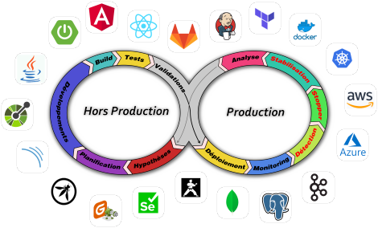

Philippe Bousquet <pbousquet@sqli.com>

== Objectifs de la présentation

[%step]
* Présenter les différentes facettes du Développeur
* Sur une stack Angular / Spring-Boot
* Sur l'application la plus importante de SQLI : *Hello World* 

=== En détail

[%step]
* Développer une API (Back)
* Développer une Interface Web (Front)
* Mise en place de l'environnement sur AWS (Infra)
* Mise en place de la chaîne CI/CD
* Et tester tout cela en live 

== L'approche DevSecOps

L'approche DevSecOps vise à améliorer :
[%step]
* La Qualité
* La Sécurité
* La Fiabilité

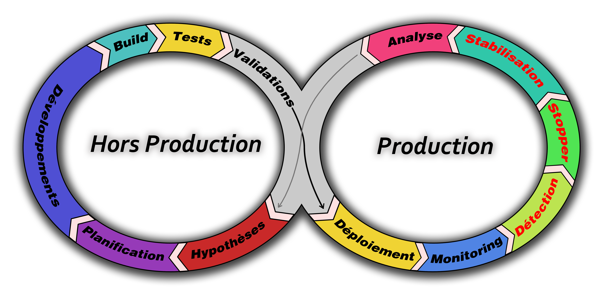

[.notes]
--
L'approche DevSecOps est une méthodologie de meilleures pratiques informatiques qui réunit les développeurs et l'équipe chargée des opérations afin de développer et de distribuer rapidement de nouveaux services et de nouvelles fonctionnalités logicielles. L'approche DevSecOps permet aux équipes de collaborer et d'accélérer le processus entre le développement et le déploiement, tout en continuant d'améliorer les points suivants :
--

=== La Plateforme d'Intégration Continue

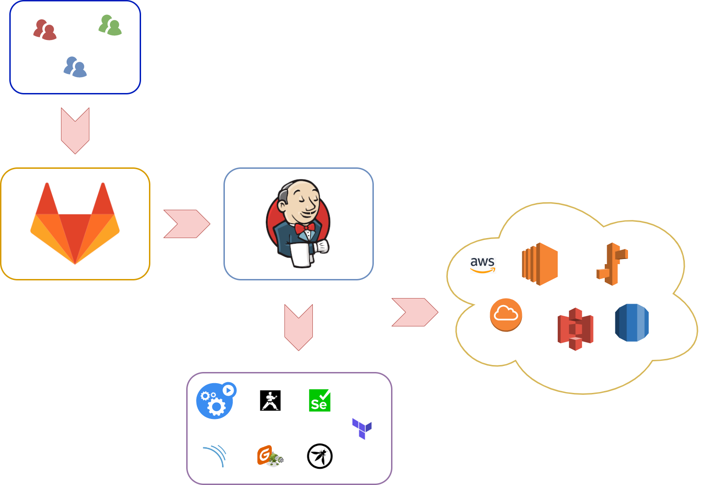

* *Everything as code*
* *SSOT: Single Source Of Truth*

[.notes]
--
* *Everything as code*
** code (java, js, …​), conf (properties, json, yaml,…​), doc (asciidoc, markdown, …​), env (Dockerfile, Vagrantfile, playbook Ansible, bash…​)
* *SSOT: Single Source Of Truth*
** Point de vérité unique
--

== Conception et Documentation As Code

  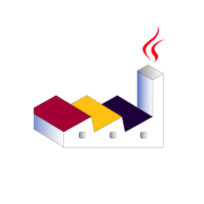 

=== Divers Outils

Plusieurs outils :

[%step]
* Asciidoc ou Markdown pour la documentation
* PlantUML pour les diagrammes et schémas
* OpenAPI pour la conception d'API
* ...

[%step]
TIP: Meilleur suivi des modifications dans GIT

[.notes]
--
Nous pouvons utiliser des outils pour la documentation et la conception :
--

=== Asciidoc : Documenter puis générer au format voulu

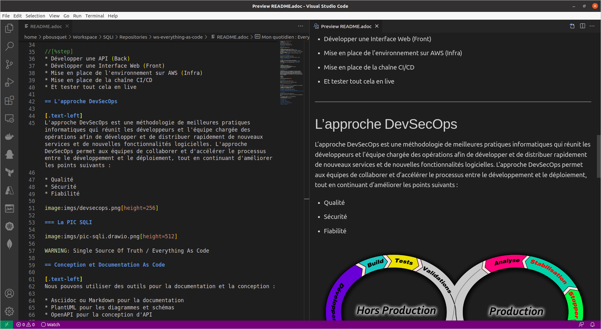

=== Asciidoc : Documenter puis générer au format voulu

[source,sh]
----
docker run --name convert --rm -e FORMAT=revealjs-sqli -e REVEALJSTHEME= -e CSS=offline -e THEME= \
    -v /home/pbousquet/Workspace/SQLI/Repositories/ws-everything-as-code:/documents \
    -v /etc/localtime:/etc/localtime:ro \
    registry-private.docker.iscbordeaux.lan.bdx.sqli.com/sqli/asciidoctor:latest \
    README.adoc
----

[%step]
* Peu de mise en forme 
* Des plugins pour divers IDEs
* Une image docker pour la génération
* Multiple formats (HTML, PDF, RevealJS, DOCX, PPTX)

=== PlantUml : Concevoir ses diagrammes UML

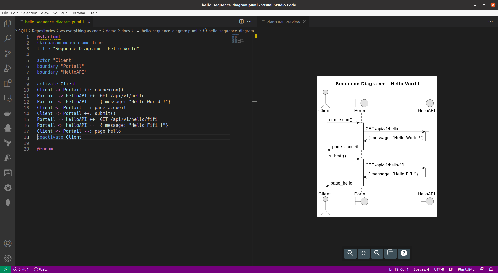

=== PlantUml : Concevoir ses diagrammes UML

[%step]
* Tout type de diagrame UML (Activité, Séquence, Classes, ...)
* Des plugins pour divers IDEs
* Un éditeur Online https://www.planttext.com/
* Plusieurs formats (png, svg, html, pdf, txt, ...)
* Extension pour le support du Modèle C4

=== OpenAPI : Concevoir ses APIs

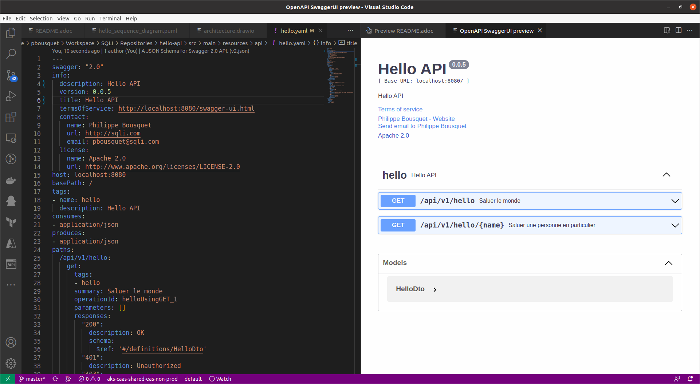

=== OpenAPI : Concevoir ses APIs

[source,sh]
----
docker run --name swagge-editor swaggerapi/swagger-editor -p 80:8080
----

[%step]
* Designer son API pour une approche Design First
* Des plugins pour divers IDEs
* Un éditeur Online https://editor.swagger.io/
* Ou via une image docker 

=== Dans une moindre mesure Drawio

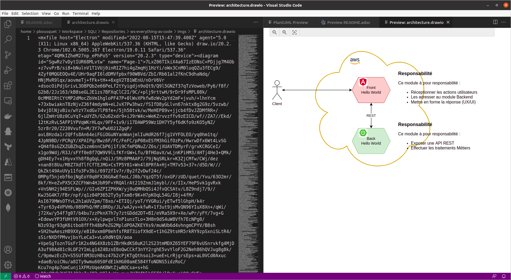

=== Dans une moindre mesure Drawio

[%step]
* Permet de faire tout type de shcema
* Sauvegarde au format XML et export en plusieurs format dont PNG
* Des plugins pour divers IDEs
* Un éditeur Online https://draw.io/
* Existe sous forme d'application standalone

=== La conception de Hello World 

Le Dossier d'Architecture Technique :

[%step]
* Les modules et leurs responsabilités 
* Les stacks générales
* Où sera hébergée notre application  

[.notes]
--
Nous devons d'abord définir la conception générale de notre application dans un document (asciidoc)
--

=== L'architecture génerale (drawio)

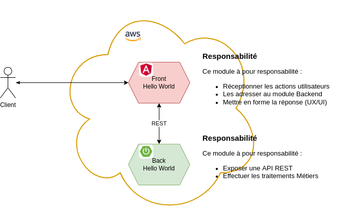

=== Le use case fonctionnel (plantuml)

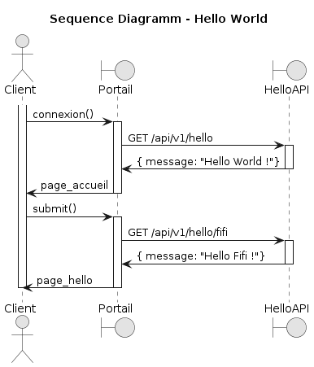

=== Les besoins en infrastructure (drawio)

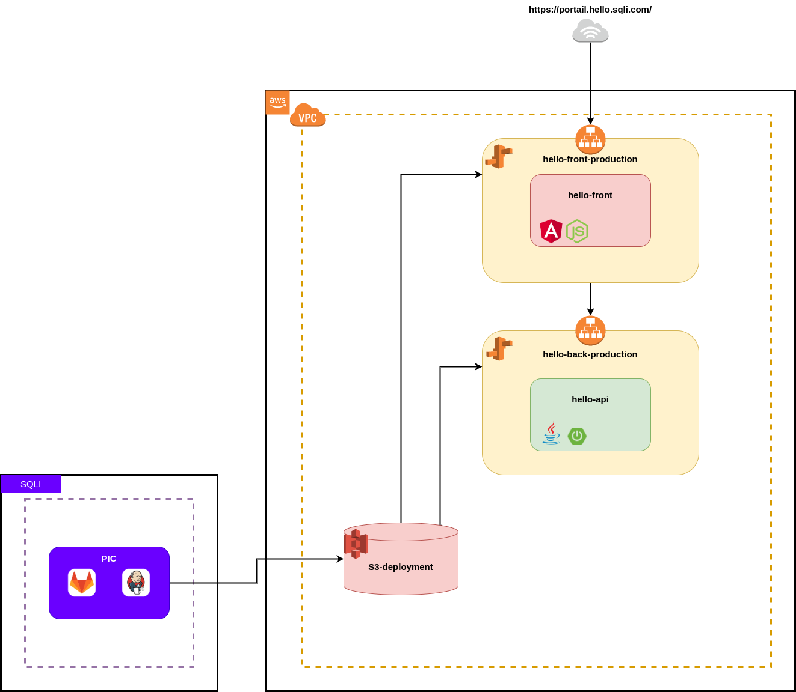

== Provisionner l'Infrastructure

 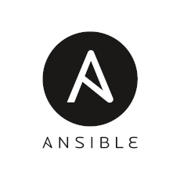 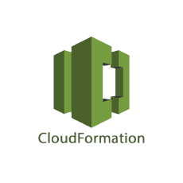 

=== La Console AWS

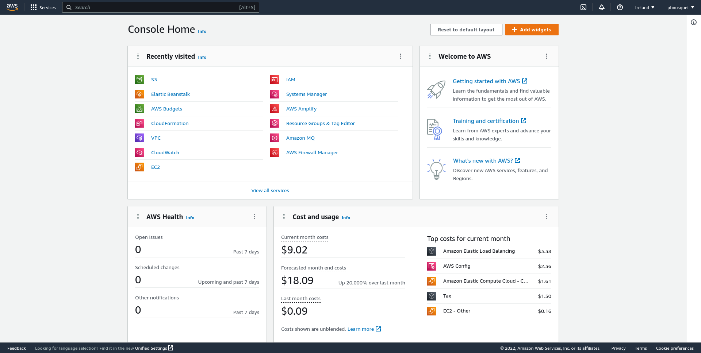

[.notes]
--
Dans ce talk nous allons déployer sur AWS, voici la console d'administration.
Cependant nous n'allons pas créer les ressources via celle-ci.
Nous allons utiliser ce que nous appelons de l'Infrastructure As Code.
--

=== Terraform 

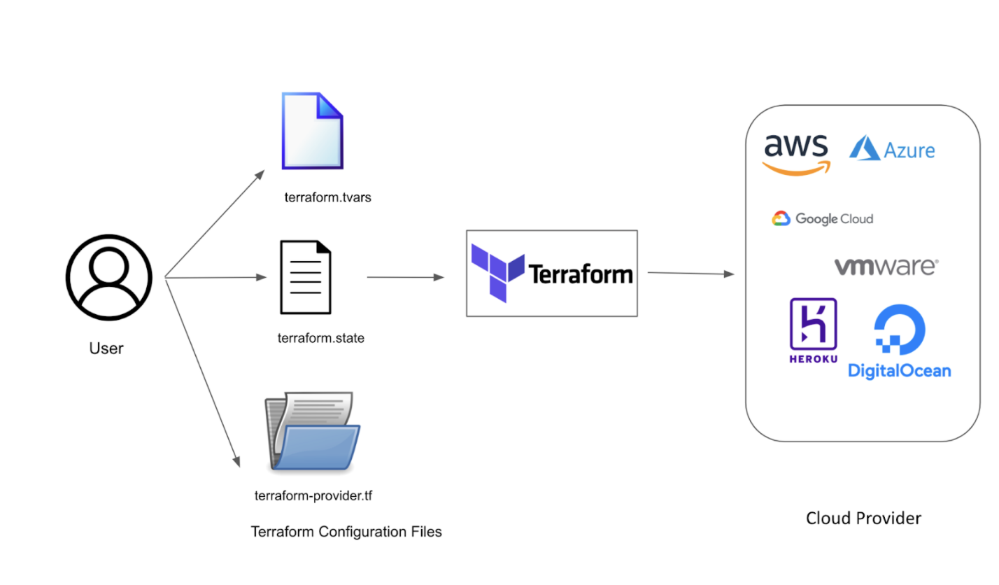

[.notes]
--
Terraform est un outil logiciel open source d'infrastructure en tant que code créé par HashiCorp. Les utilisateurs définissent et fournissent l'infrastructure du centre de données à l'aide d'un langage de configuration déclaratif appelé HashiCorp Configuration Language (HCL), ou éventuellement JSON.
--

=== L'infrastructure nécessaire

=== Infrastructure As Code 

[source,terraform]
----
# Create s3 bucket for deployment
resource "aws_s3_bucket" "deploy_bucket" {
  bucket = var.bucket_name
}
resource "aws_s3_bucket_acl" "deploy_bucket_acl" {
  bucket = aws_s3_bucket.deploy_bucket.id
  acl    = "private"
}

# Create elastic beanstalk application
 
resource "aws_elastic_beanstalk_application" "elasticapp_back" {
  name = var.elasticapp_back
}
 
# Create elastic beanstalk Environment
 
resource "aws_elastic_beanstalk_environment" "beanstalkappenv_back" {
  name                = var.beanstalkappenv_back
  application         = aws_elastic_beanstalk_application.elasticapp_back.name
  solution_stack_name = var.solution_stack_name_back
  tier                = var.tier
 
  setting {
    namespace = "aws:ec2:vpc"
    name      = "VPCId"
    value     = var.vpc_id
  }
  setting {
    namespace = "aws:autoscaling:launchconfiguration"
    name      = "IamInstanceProfile"
    value     =  "aws-elasticbeanstalk-ec2-role"
  }
  setting {
    namespace = "aws:ec2:vpc"
    name      = "AssociatePublicIpAddress"
    value     =  "True"
  }
 
  setting {
    namespace = "aws:ec2:vpc"
    name      = "Subnets"
    value     = join(",", var.public_subnets)
  }
  setting {
    namespace = "aws:elasticbeanstalk:environment:process:default"
    name      = "MatcherHTTPCode"
    value     = "200"
  }
  setting {
    namespace = "aws:elasticbeanstalk:environment"
    name      = "LoadBalancerType"
    value     = "application"
  }
  setting {
    namespace = "aws:autoscaling:launchconfiguration"
    name      = "InstanceType"
    value     = var.instance_type
  }
  setting {
    namespace = "aws:ec2:vpc"
    name      = "ELBScheme"
    value     = "internet facing"
  }
  setting {
    namespace = "aws:autoscaling:asg"
    name      = "MinSize"
    value     = var.minsize
  }
  setting {
    namespace = "aws:autoscaling:asg"
    name      = "MaxSize"
    value     = var.maxsize
  }
  setting {
    namespace = "aws:elasticbeanstalk:healthreporting:system"
    name      = "SystemType"
    value     = "enhanced"
  }
 
}

# Create elastic beanstalk application
 
resource "aws_elastic_beanstalk_application" "elasticapp_front" {
  name = var.elasticapp_front
}
 
# Create elastic beanstalk Environment
 
resource "aws_elastic_beanstalk_environment" "beanstalkappenv_front" {
  name                = var.beanstalkappenv_front
  application         = aws_elastic_beanstalk_application.elasticapp_front.name
  solution_stack_name = var.solution_stack_name_front
  tier                = var.tier
 
  setting {
    namespace = "aws:ec2:vpc"
    name      = "VPCId"
    value     = var.vpc_id
  }
  setting {
    namespace = "aws:autoscaling:launchconfiguration"
    name      = "IamInstanceProfile"
    value     =  "aws-elasticbeanstalk-ec2-role"
  }
  setting {
    namespace = "aws:ec2:vpc"
    name      = "AssociatePublicIpAddress"
    value     =  "True"
  }
 
  setting {
    namespace = "aws:ec2:vpc"
    name      = "Subnets"
    value     = join(",", var.public_subnets)
  }
  setting {
    namespace = "aws:elasticbeanstalk:environment:process:default"
    name      = "MatcherHTTPCode"
    value     = "200"
  }
  setting {
    namespace = "aws:elasticbeanstalk:environment"
    name      = "LoadBalancerType"
    value     = "application"
  }
  setting {
    namespace = "aws:autoscaling:launchconfiguration"
    name      = "InstanceType"
    value     = var.instance_type
  }
  setting {
    namespace = "aws:ec2:vpc"
    name      = "ELBScheme"
    value     = "internet facing"
  }
  setting {
    namespace = "aws:autoscaling:asg"
    name      = "MinSize"
    value     = var.minsize
  }
  setting {
    namespace = "aws:autoscaling:asg"
    name      = "MaxSize"
    value     = var.maxsize
  }
  setting {
    namespace = "aws:elasticbeanstalk:healthreporting:system"
    name      = "SystemType"
    value     = "enhanced"
  }
 
}
----

On déclare dans un fichier _main.tf_ les ressources que nous souhaitons créer :

[%step]
* Un bucket S3 pour réceptionner les packages applicatifs
* Un Elastic Beanstalk basé sur une plateforme Node pour notre code Angular
* Un Elastic Beanstalk basé sur une plateforme Java 11 pour notre API

=== Validate, Plan, Apply

[%step]
[source,bash]
----
# Vérifier que la configuration est valide
✔ ~/Workspace/SQLI/Repositories/ws-everything-as-code/demo/infra [master|✚ 6…15] 
07:49 $ terraform validate
Success! The configuration is valid.
----
[%step]
[source,bash]
----
# Vérifier ce que terraform va créer
✔ ~/Workspace/SQLI/Repositories/ws-everything-as-code/demo/infra [master|✚ 6…15] 
07:49 $ terraform plan
...
Plan: 6 to add, 0 to change, 0 to destroy.
----
[%step]
[source,bash]
----
# Appliquer les changements
✔ ~/Workspace/SQLI/Repositories/ws-everything-as-code/demo/infra [master|✚ 6…15] 
07:50 $ terraform apply -auto-approve
...
Apply complete! Resources: 6 added, 0 changed, 0 destroyed.
----

== Développer l'API (le Back)

 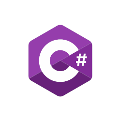 

   

=== L'approche Design First

La spécification OpenAPI (OAS) :
[%step]
* Le site d'OpenApi : https://www.openapis.org/
* Les spécifications : http://spec.openapis.org/oas/v3.0.3

[.notes]
--
La spécification OpenAPI (OAS) définit une description d'interface standard indépendante du langage de programmation pour les API REST, qui permet aux humains et aux ordinateurs de découvrir et de comprendre les capacités d'un service sans avoir besoin d'accéder au code source, à la documentation supplémentaire ou à l'inspection du trafic réseau. _(http://spec.openapis.org/oas/v3.0.3[OpenAPI])_
--

=== Commencer par définir son API

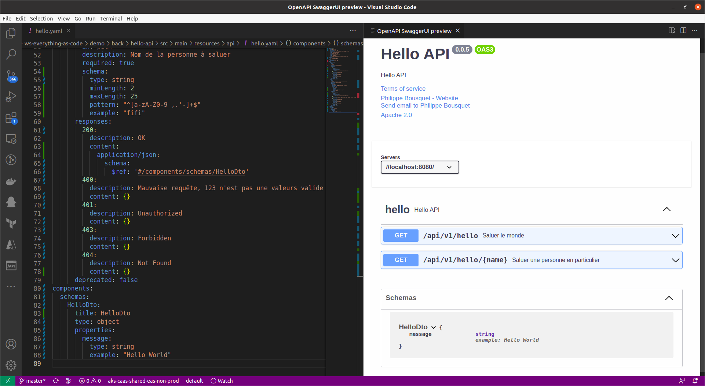

[%step]
* Les routes : /api/v1/hello
* Les verbes : GET, POST, PUT, DELETE, ...
* Les paramètres et les réponses
* Les codes retours
* La documentation

=== Génération code serveur

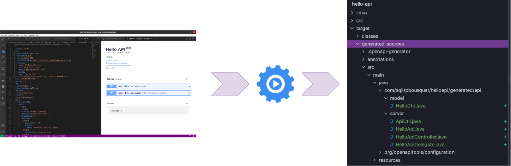

https://github.com/OpenAPITools/openapi-generator[openapi-generator] permet de générer le code serveur :

[%step]
* Controlleurs, DTOs, Tests unitaires, Documentation
* Un pluggin (maven par exemple) s'exécute durant le build (intégré dans la chaine CI)
* Plusieurs langages sont supportés : .Net, Java, Spring, Kotlin, Python, NodeJs,...

=== L'interface API générée

[source,java]
----
@Generated(value = "org.openapitools.codegen.languages.SpringCodegen")
@Validated
@Tag(name = "Hello", description = "Hello API")
public interface HelloApi {

    default HelloApiDelegate getDelegate() {
        return new HelloApiDelegate() {};
    }

    /**
     * GET /api/v1/hello/{name} : Saluer une personne en particulier
     *
     * @param name Nom de la personne à saluer (required)
     * @return OK (status code 200)
     *         or Mauvaise requête, 123 n&#39;est pas une valeurs valide (status code 400)
     *         or Unauthorized (status code 401)
     *         or Forbidden (status code 403)
     *         or Not Found (status code 404)
     */
    @Operation(
        operationId = "helloUsingGET",
        summary = "Saluer une personne en particulier",
        tags = { "hello" },
        responses = {
            @ApiResponse(responseCode = "200", description = "OK", content = {
                @Content(mediaType = "application/json", schema = @Schema(implementation = HelloDto.class))
            }),
            @ApiResponse(responseCode = "400", description = "Mauvaise requête, 123 n'est pas une valeurs valide"),
            @ApiResponse(responseCode = "401", description = "Unauthorized"),
            @ApiResponse(responseCode = "403", description = "Forbidden"),
            @ApiResponse(responseCode = "404", description = "Not Found")
        }
    )
    @RequestMapping(
        method = RequestMethod.GET,
        value = "/api/v1/hello/{name}",
        produces = { "application/json" }
    )
    default ResponseEntity<HelloDto> helloUsingGET(
        @Pattern(regexp = "^[a-zA-Z0-9 ,.'-]+$") @Size(min = 2, max = 25) @Parameter(name = "name", description = "Nom de la personne à saluer", required = true) @PathVariable("name") String name
    ) {
        return getDelegate().helloUsingGET(name);
    }

    /**
     * GET /api/v1/hello : Saluer le monde
     *
     * @return OK (status code 200)
     *         or Unauthorized (status code 401)
     *         or Forbidden (status code 403)
     *         or Not Found (status code 404)
     */
    @Operation(
        operationId = "helloUsingGET1",
        summary = "Saluer le monde",
        tags = { "hello" },
        responses = {
            @ApiResponse(responseCode = "200", description = "OK", content = {
                @Content(mediaType = "application/json", schema = @Schema(implementation = HelloDto.class))
            }),
            @ApiResponse(responseCode = "401", description = "Unauthorized"),
            @ApiResponse(responseCode = "403", description = "Forbidden"),
            @ApiResponse(responseCode = "404", description = "Not Found")
        }
    )
    @RequestMapping(
        method = RequestMethod.GET,
        value = "/api/v1/hello",
        produces = { "application/json" }
    )
    default ResponseEntity<HelloDto> helloUsingGET1(
        
    ) {
        return getDelegate().helloUsingGET1();
    }

}
----

[.notes]
--
openapi-generator a généré l'exposition de nos APIs ainsi que la documentation associée.
--

=== L'imlementation à réaliser

[source,java]
----
package com.sqli.pbousquet.helloapi.api.impl;

import com.sqli.pbousquet.helloapi.generated.api.model.HelloDto;
import com.sqli.pbousquet.helloapi.generated.api.server.HelloApiDelegate;
import org.springframework.http.ResponseEntity;
import org.springframework.stereotype.Component;
import org.springframework.web.bind.annotation.CrossOrigin;

@Component
@CrossOrigin(origins = "*")
public class HelloApiDelegateImpl implements HelloApiDelegate {

    @Override
    public ResponseEntity<HelloDto> helloUsingGET1() {
        HelloDto result = new HelloDto();
        result.setMessage("Hello World");
        return ResponseEntity.ok(result);
    }

    @Override
    public ResponseEntity<HelloDto> helloUsingGET(String name) {
        HelloDto result = new HelloDto();
        result.setMessage("Hello "+name);
        return ResponseEntity.ok(result);
    }
}
----

[.notes]
--
Nous n'avons qu'à nous soucier du code métier à réaliser.
--

=== Tester l'application Back

http://localhost:8080/swagger-ui/index.html

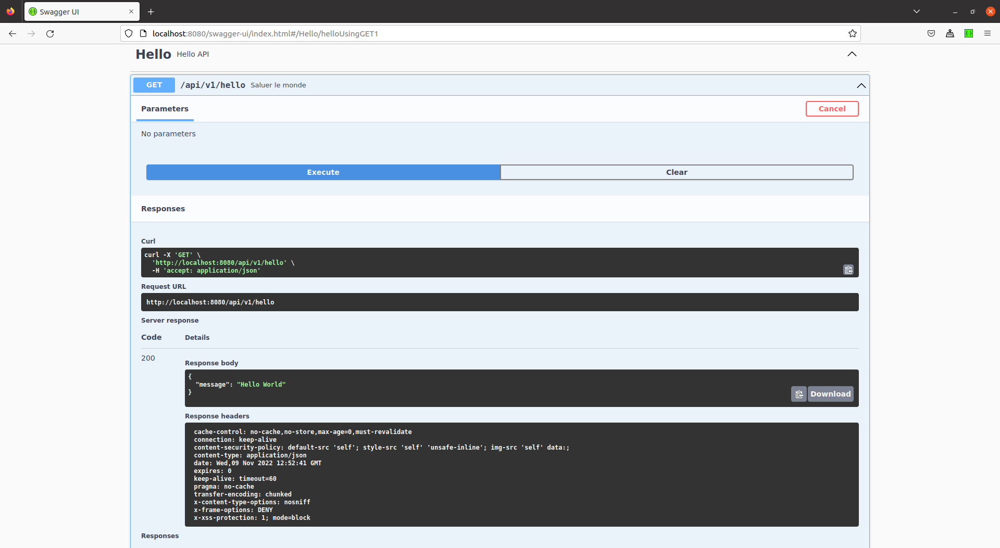

== Développer le Front

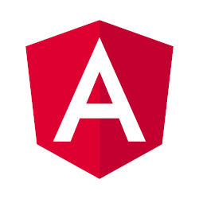   

=== Créer une application angular

On se base sur la CLI de Angular pour générer une nouvelle application et la builder

[source,bash]
----
pbousquet@BDX69N84D3:~/Workspace$ mkdir tmp
pbousquet@BDX69N84D3:~/Workspace$ ng new hello-front
? Would you like to add Angular routing? Yes
? Which stylesheet format would you like to use? SCSS   [ https://sass-lang.com/documentation/syntax#scss                ]
CREATE hello-front/README.md (1056 bytes)
CREATE hello-front/.editorconfig (274 bytes)
...
CREATE hello-front/src/app/app.component.spec.ts (1088 bytes)
CREATE hello-front/src/app/app.component.ts (216 bytes)
✔ Packages installed successfully.
    Successfully initialized git.
pbousquet@BDX69N84D3:~/Workspace$ cd hello-front/
✔ ~/Workspace/hello-front [master L|✔] 
15:52 $ ng serve
? Would you like to share anonymous usage data about this project with the Angular Team at
Google under Google’s Privacy Policy at https://policies.google.com/privacy? For more
details and how to change this setting, see https://angular.io/analytics. (y/N) n
----

=== Vérifier que l'application fonctionne

http://localhost:4200/

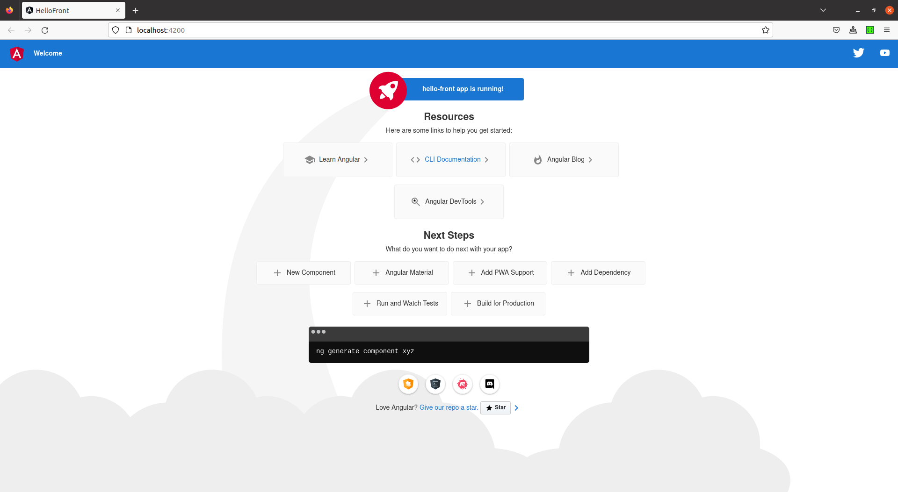

=== Refaire la partie présentation

Le module app.component.html

[source,html]
----

<h1>{{title}}</h1>
----

Le module app.component.ts

[source,js]
----
import { Component } from '@angular/core';

@Component({
  selector: 'app-root',
  templateUrl: './app.component.html',
  styleUrls: ['./app.component.scss'],
})
export class AppComponent { 
  title = 'Appel de l\'api hello';
}
----

=== OpenApi génération code client

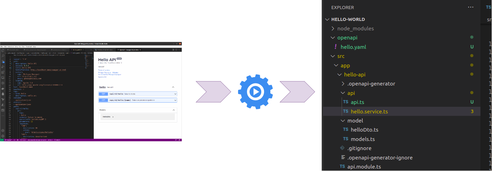

[.text-left]
L'outil permet également de générer le code client permettant de consommer une API

[source,sh]
----
$ npm i @openapitools/openapi-generator-cli -D
----

Modifier le package.json

[source,json]
----
  "scripts": {
    "generate:api": "openapi-generator-cli generate -i ./openapi/hello.yaml -g typescript-angular -o src/app/hello-api"
  }
----

=== Brancher l'api dans le code Angular 1/2

Le module app.module.ts 

[source,js]
----
import { NgModule } from '@angular/core';
import { BrowserModule } from '@angular/platform-browser';
import { HttpClientModule } from '@angular/common/http'
import { AppRoutingModule } from './app-routing.module';
import { AppComponent } from './app.component';
import { ApiModule } from './hello-api/api.module'

@NgModule({
  declarations: [
    AppComponent
  ],
  imports: [
    BrowserModule,
    HttpClientModule,
    AppRoutingModule,
    ApiModule
  ],
  providers: [],
  bootstrap: [AppComponent]
})
export class AppModule { }
----

=== Brancher l'api dans le code Angular 2/2

Le module app.component.ts

[source,js]
----
import { Component } from '@angular/core';
import { HelloService } from './hello-api/api/hello.service';

@Component({
  selector: 'app-root',
  templateUrl: './app.component.html',
  styleUrls: ['./app.component.scss'],
})
export class AppComponent { 
  title = 'Appel de l\'api hello';
  result = this.helloService.helloUsingGET1().subscribe(helloDto => (this.title = helloDto.message!));
  constructor(private helloService: HelloService){}
}
----

== Mettre en place la chaine de CI/CD

  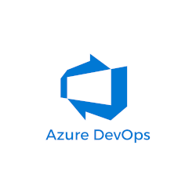 

=== Jenkins

image:imgs/jenkins.png[width=150] 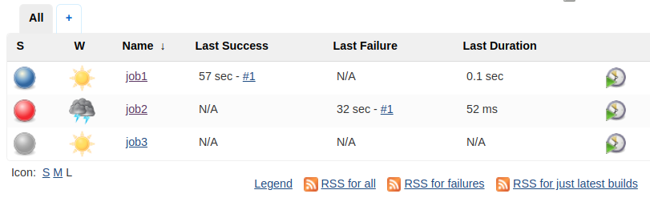

Executeur de Jobs...

=== ou plutôt 

image:imgs/jenkins-master-agents.png[height=300]

Un chef d'orchestre  qui délègue le job à des agents 

=== Jenkinsfile - 1er Pipeline de build

[source, groovy]
----
node() {

    stage('CLEAN WORKSPACE') {
        echo "########## CLEAN WORKSPACE ${workspace} ##########"
        sh "rm -rf ${workspace}/*"
    }

    stage('CHECKOUT') {
        echo "########## GIT CLONE ##########"
        git branch: "master", credentialsId: "${gitParams.credentialsId}", url: "${gitParams.urlProject}"
    }

    stage('PROVISIONNING') {
        echo "########## TERRAFORM PLAN ##########"
        sh "cd infra && terraform plan"
        echo "########## TERRAFORM APPLY ##########"
        sh "cd infra && terraform apply -auto-approve"
    }

    stage('BUILD HELLO-BACK') {
        echo "########## GENERATE JAR BY MAVEN ##########"
        sh "cd ${workspace}/back/hello-api && mvn clean package -U"
        echo "########## ZIP PACKAGE ##########"
        sh "cp ${workspace}/back/hello-api/target/classes/Procfile ${workspace}/back/hello-api/target/  && cd ${workspace}/back/hello-api/target/ && zip hello-back.zip helloapi-0.0.5-SNAPSHOT.jar server.js Procfile"
    }

    stage('BUILD HELLO-FRONT') {
        echo "########## GENERATE BY NG ##########"
        sh "cd ${workspace}/front/hello-world && ng build"
        echo "########## ZIP PACKAGE ##########"
        sh "cp -r ${workspace}/front/hello-world/dist ${workspace}/front/hello-world/server/ && cd ${workspace}/front/hello-world/server && zip hello-front.zip dist/ server.js package.json"
    }

    stage('DEPLOY AWS HELLO-BACK') {
        echo "Uploader le composant sur hello-deployment-bucket : hello-back"
        sh "aws s3 cp ${workspace}/back/hello-api/target/hello-api-0.0.5-SNAPSHOT.zip " +
            "s3://hello-deployment-bucket/hello-back.${timestamp}.zip"
        echo "Créer une nouvelle version de l’application hello-back.${timestamp}"
        sh "aws elasticbeanstalk create-application-version --application-name hello-back " +
            "--version-label hello-back.${timestamp} --source-bundle S3Bucket=\"hello-deployment-bucket\",S3Key=\"hello-back.${timestamp}.zip\" " +
            "--no-auto-create-application --process"
        echo "Déployer la nouvelle version dans l’environnement hello-back-env : hello-back.${timestamp}"
        sh "aws elasticbeanstalk update-environment --environment-name hello-back-env --version-label hello-back.${timestamp}"
    }

    stage('DEPLOY AWS HELLO-FRONT') {
        echo "Uploader le composant sur hello-deployment-bucket : hello-front"
        sh "aws s3 cp ${workspace}/front/hello-world/hello-front.zip " +
            "s3://hello-deployment-bucket/hello-front.${timestamp}.zip"
        echo "Créer une nouvelle version de l’application hello-front.${timestamp}"
        sh "aws elasticbeanstalk create-application-version --application-name hello-front " +
            "--version-label hello-front.${timestamp} --source-bundle S3Bucket=\"hello-deployment-bucket\",S3Key=\"hello-front.${timestamp}.zip\" " +
            "--no-auto-create-application --process"
        echo "Déployer la nouvelle version dans l’environnement hello-front-env : hello-front.${timestamp}"
        sh "aws elasticbeanstalk update-environment --environment-name hello-front-env --version-label hello-front.${timestamp}"
    }
}
----

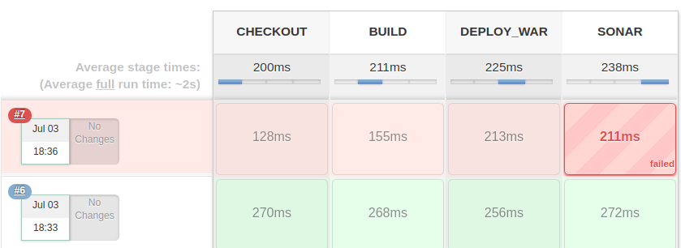

=== Un pipeline chez SQLI

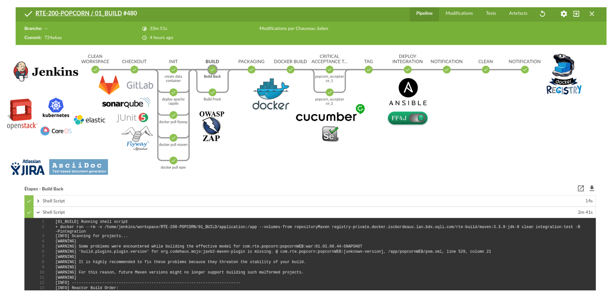

== Et donc l'application Hello ?

=== L'api 

http://hello-back-env.<server-url>/swagger-ui/index.html

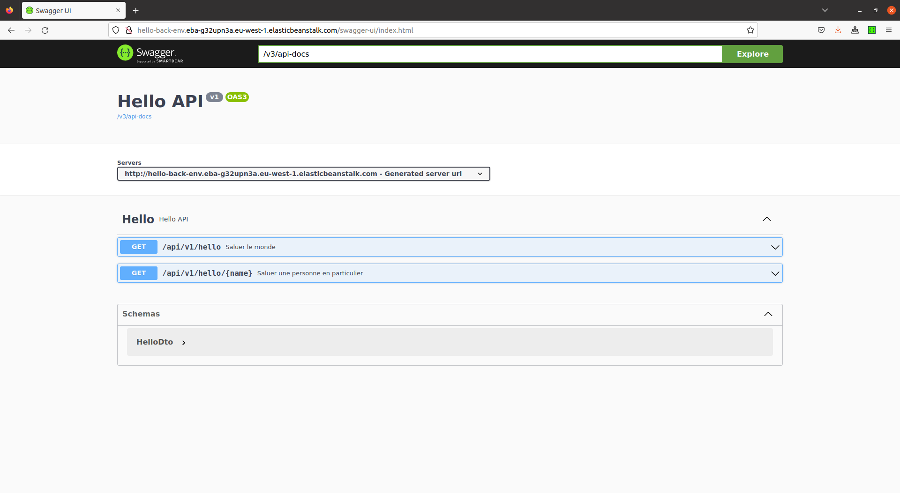

=== Le front

http://hello-front-env..<server-url>/

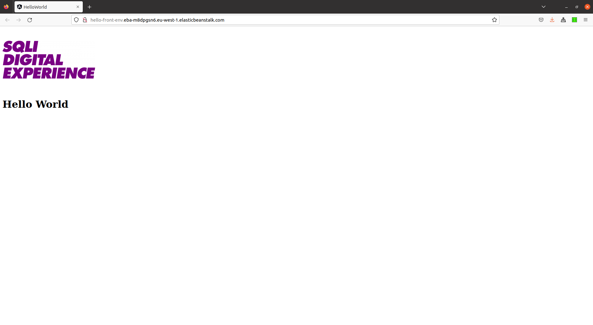

== Merci !

https://tinyurl.com/ws-everything-as-code

image::imgs/questions.png[width=256]

*Gihtub :* @darken33